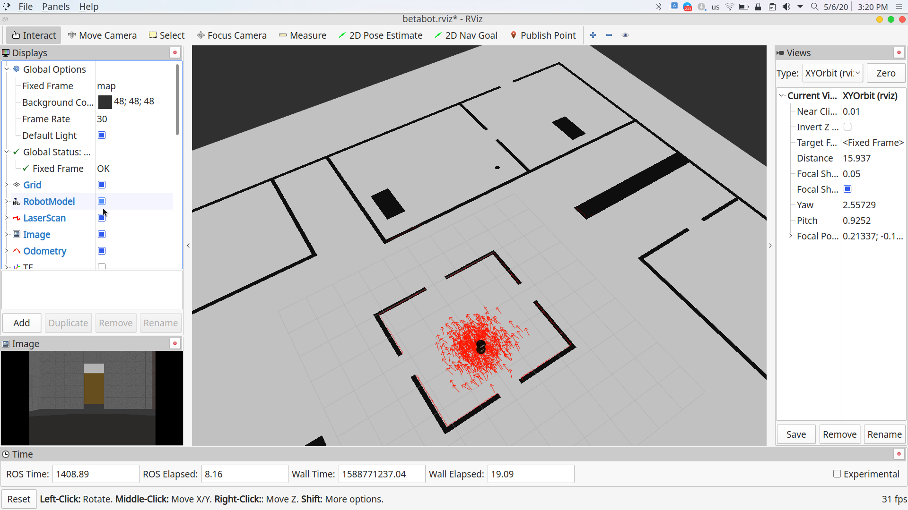

# Betabot Localization and Navigation

- [Betabot Localization and Navigation](#betabot-localization-and-navigation)
  - [Project Description](#project-description)
  - [GUID](#guid)
  - [Project Rubric](#project-rubric)
  - [After you implement the pkg state your reflection below](#after-you-implement-the-pkg-state-your-reflection-below)
  - [Part I: Map (map_server)](#part-i-map-mapserver)
    - [In your own words how maps are represented in ROS?](#in-your-own-words-how-maps-are-represented-in-ros)
    - [State 5 algorithm for SLAM and the ROS implementation](#state-5-algorithm-for-slam-and-the-ros-implementation)
  - [Part II: Localization (amcl)](#part-ii-localization-amcl)
    - [In your own words how amcl works?](#in-your-own-words-how-amcl-works)
    - [Is there other better approaches to localize your robot rather than amcl?](#is-there-other-better-approaches-to-localize-your-robot-rather-than-amcl)
    - [What are the amcl limitations or the fail cases?](#what-are-the-amcl-limitations-or-the-fail-cases)
    - [Is amcl used in domain rather than Robotics?](#is-amcl-used-in-domain-rather-than-robotics)
  - [Part III: Navigation (move_base)](#part-iii-navigation-movebase)
    - [How many official local planner available in ROS?](#how-many-official-local-planner-available-in-ros)
    - [which local planner did you use?](#which-local-planner-did-you-use)
    - [In your own words how the local planner you selected works?](#in-your-own-words-how-the-local-planner-you-selected-works)
    - [How many official global planner available in ROS?](#how-many-official-global-planner-available-in-ros)
    - [which global planner did you use?](#which-global-planner-did-you-use)
    - [In your own words how the global planner you selected works?](#in-your-own-words-how-the-global-planner-you-selected-works)
    - [State your suggestion increase the overall performance?](#state-your-suggestion-increase-the-overall-performance)
    - [List the most time consuming problems you faced](#list-the-most-time-consuming-problems-you-faced)
    - [Demos](#demos)
    - [Screenshots](#screenshots)
      - [NAME:](#name)
      - [ID:](#id)

## Project Description 

Create a ROS package with custom launch files to localize the robot in an environment given the map and also to autonomous navigation. 

*Use the given [map](map/map2d.yaml) for the myoffice world [here](../betabot_gazebo/worlds/myoffice.world)* 

   
  

>NOTE: For the given map and a world the betabot robot should localize it self and move from currant pose to a given goal autonomously

## GUID
Follow where am I project from Udacity Software Robotics Engineer Nanodegree.

---
## Project Rubric

 

---

## After you implement the pkg state your reflection below 

---
## Part I: Map (map_server)

###  In your own words how maps are represented in ROS?
They are represented as PGM images where any object in the map is represented with a value of 0 which is black, and empty space is represented with a value of 255 which is white. 

###  State 5 algorithm for SLAM and the ROS implementation

| SLAM Algorithm | ROS implementation |
|:--------------:|:------------------:|
|     GMapping   |      gmapping      |
|  Gridmap SLAM  |   mrpt_rbpf_slam   |
|  Hector SLAM   |    hector_slam     |
|    tinySLAM    |   slam_constructor |
|    vinySLAM    |  slam_constructor  |

---

## Part II: Localization (amcl)

### In your own words how amcl works?
Adaptive Monte Carlo Localization is a probilistic model that tries to localize the robot based on LaserScan data. The lasterScan data is compared to the given map to compare between its estimated pose and how far it is from the ground truth. This difference between the estimate and the reality is then tuned to get closer to the real readings by publishing to the odom topic the translational change needed.

### Is there other better approaches to localize your robot rather than amcl?
Yes, 

### What are the amcl limitations or the fail cases?
AMCL depends on a 2D map of the environment. Hence, any object at a height different than that of the map will be ignored.

### Is amcl used in domain rather than Robotics?
It can be used for a wide range of applications but they're all under the same field of robotics.

---

## Part III: Navigation (move_base)

### How many official local planner available in ROS?
base_local_planner and dwa_local_planner.

### which local planner did you use?
Base

### In your own words how the local planner you selected works?
It tries to reach the global planner's destination point sending the velocity commands to the robot.

### How many official global planner available in ROS?
global_planner and carrot_planner.

### which global planner did you use?
global

### In your own words how the global planner you selected works?
From its name, the global planner plans the 'big picture'. It plans the path it will take from the start point to the desired location.

---

### State your suggestion increase the overall performance?
Use 3D vision to enable better localization and obstacle avoidance.

### List the most time consuming problems you faced
Tuning the parameters.

---

### Demos
Add unlisted youtube/drive videos

[Demo](https://drive.google.com/file/d/1orKBm-jbj3XeGLyzRuYHYaN9AmLXlQxT/view?usp=sharing)

### Screenshots
1. rviz with all navigation launchers from turtulbot
2. gazebo

---

#### NAME:
Alaa Mohamed Roshdy
#### ID:
201600031

---
